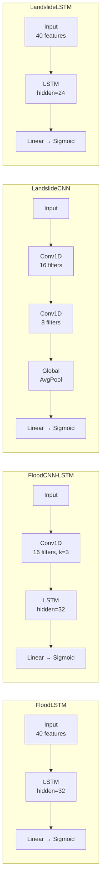

<


GeoShield AI is a **full-stack Geospatial Disaster Intelligence Platform** for real-time **flood prediction, landslide susceptibility assessment, disaster monitoring, evacuation planning, and emergency response coordination**.

The platform combines **Machine Learning, Deep Learning, Remote Sensing, GIS, Earth Observation Data, and Real-Time Web Technologies** into a unified disaster management system, providing intelligent hazard prediction and decision support at coordinate-level precision.

---

## 📑 Table of Contents

- [Overview](#-overview)
- [Key Features](#-key-features)
- [Technology Stack](#-technology-stack)
- [Machine Learning Pipeline](#-machine-learning-pipeline)
  - [Flood Prediction Ensemble](#flood-prediction-ensemble)
  - [Landslide Susceptibility Ensemble](#landslide-susceptibility-ensemble)
  - [Deep Learning Architectures](#deep-learning-architectures)
  - [Model Performance](#model-performance)
- [Project Structure](#-project-structure)
- [Installation & Setup](#-installation--setup)
- [Commands Reference](#-commands-reference)
- [API Reference](#-api-reference)
- [License](#-license)

---

## 🌍 Overview

Natural disasters such as floods and landslides cause severe human and economic damage every year. Traditional warning systems are often slow, reactive, and lacking in local precision.

GeoShield AI addresses this challenge by integrating **Artificial Intelligence, GIS Mapping, Google Earth Engine satellite observation, weather data, and community reports** into a single, cohesive decision support platform. The system:

- **Predicts** hazard risks at high geospatial resolution using ensemble ML/DL models
- **Explains** prediction factors using SHAP (SHapley Additive exPlanations)
- **Generates** safe evacuation paths that bypass hazard zones
- **Coordinates** community disaster response through volunteer networks & SOS systems
- **Monitors** river gauges and soil probes via real-time WebSocket telemetry

---

## ✨ Key Features

| Feature | Description |
| :--- | :--- |
| 🌍 **Live GIS Map Dashboard** | Interactive Leaflet map with real-time risk heatmaps, terrain contours, multi-spectral index rendering (NDVI/NDWI/DEM), and custom visual overlays |
| 🤖 **Coordinate-Level AI Predictions** | Instant flood and landslide susceptibility calculations on any map click, powered by soft-voting ensemble models |
| 🛰️ **Remote Sensing Integration** | Live Google Earth Engine (GEE) integration for DEM extraction and spectral indices. Auto-fallback to high-fidelity NumPy raster simulation when GEE is unavailable |
| 📊 **Explainable AI (SHAP)** | Local SHAP force plots rendered in the UI explaining *why* a location is high-risk (rainfall, elevation, slope, vegetation, soil moisture contributions) |
| 🚨 **Real-Time WebSocket Alerts** | Persistent push alerts for telemetry changes, sensor triggers, and active sirens via WebSocket connections |
| 🛣️ **Risk-Aware Evacuation Routing** | Dynamic pathfinding that generates safe navigation routes by deflecting around current and predicted hazard zones |
| 🆘 **SOS Emergency System** | AI-powered SOS dispatch that matches the nearest available volunteer, generates safe rescue routes, and broadcasts multi-language alerts |
| 📡 **Live Sensor Telemetry** | Real-time river gauge depth monitoring and soil saturation probe readings with threshold-based critical alerts |
| 🤖 **AI Disaster Copilot** | Context-aware chatbot that answers queries about real-time hazards, nearest shelters, and evacuation instructions |
| 👥 **Crowdsourced Incident Board** | Community dashboard for citizens to report hazard events, upload coordinates, and upvote/validate reports |
| 🏥 **Volunteer Coordination Grid** | Shelter status tracking, volunteer dispatch, rescue task cards, and resource monitoring |
| 📈 **Analytics & Historical Dashboard** | Prediction history, trend analysis, and model performance monitoring charts (Recharts) |
| 🔧 **Admin Control Panel** | Dynamic threat threshold adjustment, system health monitoring, and service status overview |
| 🌐 **Multi-Language Support** | Alert and UI localization in English, Hindi (हिंदी), and Marathi (मराठी) |

---

## 🛠️ Technology Stack

### Frontend

| Technology | Version | Purpose |
| :--- | :---: | :--- |
| **React** | 18.2.0 | UI component library |
| **TypeScript** | 5.2.2 | Type-safe JavaScript |
| **Vite** | 5.1.6 | Build tool & dev server |
| **TanStack React Query** | 5.101.0 | Async state management & caching |
| **Leaflet + React Leaflet** | 1.9.4 / 4.2.1 | Interactive GIS map engine |
| **Recharts** | 2.12.2 | Data visualization & analytics charts |
| **Framer Motion** | 11.0.8 | Animations & page transitions |
| **Tailwind CSS** | 3.4.1 | Utility-first CSS framework |
| **Lucide React** | 0.344.0 | Icon library |

### Backend

| Technology | Version | Purpose |
| :--- | :---: | :--- |
| **FastAPI** | 0.110.0 | Async REST + WebSocket API framework |
| **Uvicorn** | 0.28.0 | ASGI web server |
| **SQLAlchemy** | 2.0.28 | ORM & database abstraction |
| **SQLite** | — | Embedded relational database |
| **Pydantic** | 2.6.4 | Data validation & serialization |
| **python-jose** | 3.3.0 | JWT token generation & validation |
| **Passlib** | 1.7.4 | Password hashing (bcrypt) |

### Machine Learning & Data Science

| Technology | Version | Purpose |
| :--- | :---: | :--- |
| **PyTorch** | 2.2.2 | Deep learning framework (LSTM, CNN, CNN-LSTM) |
| **XGBoost** | 2.0.3 | Gradient-boosted decision tree classifier |
| **scikit-learn** | 1.4.1 | Random Forest, calibration, metrics, preprocessing |
| **SHAP** | — | Model explainability (SHapley Additive exPlanations) |
| **Pandas** | 2.2.1 | Data wrangling & DataFrame operations |
| **NumPy** | 1.26.4 | Numerical computation |
| **Joblib** | 1.3.2 | Model serialization |
| **Google Earth Engine** | 0.1.398 | Satellite imagery & remote sensing API |

---

## 🧠 Machine Learning Pipeline

GeoShield AI deploys **soft-voting ensemble classifiers** that blend the strengths of gradient-boosted trees, random forests, and PyTorch neural networks. Models are probability-calibrated using `CalibratedClassifierCV` for reliable confidence scores.

### Flood Prediction Ensemble

| Model Component | Type | Weight | Captures |
| :--- | :---: | :---: | :--- |
| **XGBoost** | Tree | 35% | Gradient-boosted tabular decision boundaries |
| **LightGBM** | Tree | 35% | Leaf-wise boosting for fast convergence |
| **CatBoost** | Tree | 15% | Categorical feature handling + ordered boosting |
| **LSTM** | DL | 7.5% | Sequential temporal rainfall anomalies |
| **CNN-LSTM** | DL | 7.5% | Spatio-temporal precipitation accumulations |

### Landslide Susceptibility Ensemble

| Model Component | Type | Weight | Captures |
| :--- | :---: | :---: | :--- |
| **XGBoost** | Tree | 35% | Gradient-boosted slope stability metrics |
| **Random Forest** | Tree | 25% | Tabular soil attributes and vegetation bounds |
| **LightGBM** | Tree | 20% | Multi-duration rainfall correlation |
| **CNN** | DL | 10% | Terrain texture grid pattern extraction |
| **LSTM** | DL | 10% | Cumulative rainfall saturation sequences |

### Deep Learning Architectures



All PyTorch models use:
- **Optimizer**: Adam with weight decay (1e-4)
- **Loss**: Binary Cross-Entropy (BCELoss)
- **Early Stopping**: Patience of 10 epochs on validation loss
- **Wrapper**: `PyTorchClassifierWrapper` for scikit-learn compatible `.predict_proba()` API

### Model Performance

Spatially-validated test-set metrics (districts unseen during training):

| Ensemble Model | Accuracy | F1 Score | ROC-AUC | PR-AUC | Brier Score |
| :--- | :---: | :---: | :---: | :---: | :---: |
| **Flood Prediction** | **94.60%** | **89.52%** | **98.10%** | **95.06%** | **0.0468** |
| **Landslide Susceptibility** | **92.13%** | **84.68%** | **97.09%** | **92.03%** | **0.0604** |

> 💡 *For detailed feature importance rankings, confusion matrices, and ROC curves, refer to [docs/ML_EVALUATION.md](docs/ML_EVALUATION.md).*

---

## 📁 Project Structure

```
geoshield-ai/
├── backend/                          # FastAPI Backend & ML/DL Pipelines
│   ├── app/                          # Core Web Application
│   │   ├── api/                      # REST & WebSocket Routers (auth, gis, predict, realtime)
│   │   ├── core/                     # Configuration, thresholds, security & i18n
│   │   ├── db/                       # SQLAlchemy models & database session
│   │   ├── services/                 # Business services (GEE, weather, rescue, evacuation, alert)
│   │   └── main.py                   # FastAPI application factory
│   ├── ml/                           # Machine Learning Pipeline
│   │   ├── data_ingestion.py         # Multi-source data ingestion
│   │   ├── feature_engineering.py    # 40-feature engineering pipeline
│   │   ├── flood_models.py           # Flood ensemble (XGBoost, LightGBM, CatBoost)
│   │   ├── landslide_models.py       # Landslide ensemble (Random Forest, XGBoost, LightGBM)
│   │   ├── deep_learning_models.py   # PyTorch architectures (LSTM, CNN, CNN-LSTM)
│   │   ├── inference.py              # MultiHazardInferenceEngine (production)
│   │   ├── shap_explainer.py         # SHAP explainability engine
│   │   └── train_advanced.py         # V2 training orchestrator
│   ├── model_dir/                    # Serialized model artifacts (.pkl, .pth)
│   ├── requirements.txt              # Backend Python dependencies
│   └── train_pipeline.py             # Basic V1 training script
├── frontend/                         # React 18 + TypeScript + Vite Dashboard
│   ├── src/
│   │   ├── components/               # Interactive UI components (Map, MLPrediction, SOS, etc.)
│   │   ├── hooks/                    # Custom React hooks (useRealTime WebSocket)
│   │   ├── App.tsx                   # Main layout and view routing
│   │   └── main.tsx                  # React entry point
│   └── package.json                  # Frontend dependencies
├── docs/                             # Documentation & ML Evaluation reports
├── Makefile                          # Build & training automation commands
└── .env.example                      # Environment variables template
```

---

## 🚀 Installation & Setup

### Prerequisites

- **Python** 3.10+
- **Node.js** 18+ and **npm** 9+
- **Git**

### 1. Clone & Configure Environment

```bash
git clone https://github.com/Tejascodes21/floodnlandslideAG.git
cd floodnlandslideAG

# Copy environment variables template
cp .env.example .env
```

### 2. Backend Setup

```bash
# Navigate to backend
cd backend

# Create and activate virtual environment
python -m venv .venv

# Activate (Windows)
.venv\Scripts\activate

# Activate (macOS/Linux)
source .venv/bin/activate

# Install Python dependencies
pip install -r requirements.txt
```

### 3. Train Models (Required before first run)

```bash
# Basic V1 training (fast, ~30 seconds)
python train_pipeline.py

# OR Advanced V2 training (full pipeline, ~5 minutes)
python -m ml.train_advanced
```

### 4. Start the Backend Server

```bash
# From the backend/ directory
uvicorn app.main:app --reload --host 0.0.0.0 --port 8000
```

The API server will be available at:
- **Base URL**: `http://localhost:8000`
- **Swagger UI (Interactive API Docs)**: `http://localhost:8000/docs`
- **ReDoc**: `http://localhost:8000/redoc`

### 5. Frontend Setup

```bash
# Open a new terminal, navigate to frontend
cd frontend

# Install Node.js dependencies
npm install

# Start Vite dev server
npm run dev
```

The web application will be available at:
- **Web Portal**: `http://localhost:5173`

### 6. Google Earth Engine (Optional)

For live satellite data instead of simulation mode:

```bash
# Authenticate with Google Earth Engine
pip install earthengine-api
earthengine authenticate

# Set your GEE project in .env
GEE_PROJECT=your-gee-project-id
```

---

## 📋 Commands Reference

### Makefile Commands

| Command | Description | Execution |
| :--- | :--- | :--- |
| `make train` | Train V1 models (XGBoost + RF) on synthetic dataset | `cd backend && python train_pipeline.py` |
| `make train-advanced` | Full V2 pipeline: real-data ingestion, spatial CV, Optuna tuning, DL training, calibration | `cd backend && python -m ml.train_advanced` |
| `make report` | Generate markdown evaluation report at `docs/ML_EVALUATION.md` | `cd backend && python -m ml.generate_report` |

### Backend Commands

```bash
# Start the API server (development mode with hot reload)
cd backend
uvicorn app.main:app --reload

# Start the API server (production mode)
cd backend
uvicorn app.main:app --host 0.0.0.0 --port 8000 --workers 4

# Run V1 basic training pipeline
cd backend
python train_pipeline.py

# Run V2 advanced training pipeline (with Optuna + PyTorch)
cd backend
python -m ml.train_advanced

# Generate ML evaluation report
cd backend
python -m ml.generate_report

# Inspect PyTorch model weights
cd backend
python inspect_pytorch.py

# Inspect pickled model metadata
cd backend
python inspect_weights.py

# Run audit pipeline (leakage + performance checks)
cd backend
python run_audit_pipeline.py

# Evaluate train/test split metrics
cd backend
python eval_train_test.py

# Google Earth Engine authentication
earthengine authenticate
```

### Frontend Commands

```bash
# Install dependencies
cd frontend
npm install

# Start development server (with HMR)
npm run dev

# Build production bundle
npm run build

# Preview production build locally
npm run preview
```

---

## 📡 API Reference

### Authentication

| Method | Endpoint | Description |
| :---: | :--- | :--- |
| `POST` | `/api/auth/register` | Register a new user (Citizen, Volunteer, Researcher, NGO, Government, Admin) |
| `POST` | `/api/auth/login` | Login and receive JWT bearer token |

### Hazard Prediction

| Method | Endpoint | Description |
| :---: | :--- | :--- |
| `POST` | `/api/predict/multi-hazard` | Full multi-hazard prediction with SHAP explanation, weather, satellite data |
| `GET` | `/api/predict/history` | Retrieve prediction history log (newest first, max 500) |

### Satellite & GIS

| Method | Endpoint | Description |
| :---: | :--- | :--- |
| `GET` | `/api/satellite/live` | Multi-spectral time-series satellite data for coordinates |
| `GET` | `/api/map/{layer}` | Spectral index snapshot (ndwi, ndvi, elevation) |
| `GET` | `/api/tile/{band}/{z}/{x}/{y}` | Satellite tile image (PNG) for Leaflet overlays |
| `POST` | `/api/route` | Calculate safe evacuation route avoiding hazard zones |

### Emergency & SOS

| Method | Endpoint | Description |
| :---: | :--- | :--- |
| `POST` | `/api/sos/create` | Create SOS alert with auto volunteer dispatch |
| `GET` | `/api/volunteers` | List all registered volunteers |
| `POST` | `/api/volunteer/{id}/dispatch` | Manually dispatch a specific volunteer |
| `GET` | `/api/missions` | List all active rescue missions |
| `POST` | `/api/mission/{id}/complete` | Mark a rescue mission as completed |

### Community Reports

| Method | Endpoint | Description |
| :---: | :--- | :--- |
| `POST` | `/api/community/report` | Submit a new incident report |
| `GET` | `/api/community/reports` | Get all community reports (newest first) |
| `POST` | `/api/community/report/{id}/upvote` | Upvote a community report |
| `POST` | `/api/community/report/{id}/status` | Update report status (admin) |

### AI Copilot

| Method | Endpoint | Description |
| :---: | :--- | :--- |
| `POST` | `/api/chatbot` | Query the AI disaster copilot chatbot |

### Real-Time & Telemetry

| Method | Endpoint | Description |
| :---: | :--- | :--- |
| `WS` | `/api/realtime/ws` | WebSocket connection for live alerts and updates |
| `GET` | `/api/realtime/telemetry` | Live river gauge & soil probe sensor readings |
| `GET` | `/api/realtime/status` | Active connection count & alert count |
| `POST` | `/api/realtime/broadcast_alert` | Broadcast an alert to all connected clients |

### System Administration

| Method | Endpoint | Description |
| :---: | :--- | :--- |
| `GET` | `/api/system/status` | System health & service status overview |
| `POST` | `/api/system/settings` | Override threat warning thresholds dynamically |

---

## 📄 License

This project is licensed under the **MIT License** — see the [LICENSE](LICENSE) file for details.

---

<p align="center">
  Built with ❤️ for disaster resilience by <strong>Tejas Nikam</strong>
</p>
]]>
