# 🛡️ GeoShield AI

### AI-Powered Geospatial Disaster Intelligence & Early Warning Platform


> **GeoShield AI** is a full-stack geospatial disaster intelligence platform designed for flood prediction, landslide susceptibility assessment, disaster monitoring, evacuation planning, and emergency response coordination.

The platform combines **Machine Learning, Deep Learning, Remote Sensing, GIS, Earth Observation Data, and real-time web technologies** into a unified decision-support system for intelligent hazard prediction and response.

---

## 📑 Table of Contents

- [Overview](#-overview)
- [Key Features](#-key-features)
- [Technology Stack](#-technology-stack)
- [Machine Learning Pipeline](#-machine-learning-pipeline)
  - [Flood Prediction Ensemble](#flood-prediction-ensemble)
  - [Landslide Susceptibility Ensemble](#landslide-susceptibility-ensemble)
  - [Deep Learning Architectures](#deep-learning-architectures)
  - [Model Configuration](#model-configuration)
  - [Model Performance](#model-performance)
- [Project Structure](#-project-structure)
- [Installation & Setup](#-installation--setup)
- [Commands Reference](#-commands-reference)
- [API Reference](#-api-reference)
- [License](#-license)

---

## 🌍 Overview

Natural disasters such as floods and landslides cause severe human and economic damage. Traditional warning systems can be slow, reactive, and limited in local spatial precision.

GeoShield AI addresses this challenge by integrating **Artificial Intelligence, GIS mapping, Google Earth Engine satellite observations, weather data, and community reports** into a single disaster-management platform.

### What GeoShield AI Does

- **Predicts** flood and landslide risks using ensemble ML/DL models.
- **Explains** model predictions using SHAP explainability.
- **Maps** hazard information through an interactive GIS dashboard.
- **Generates** risk-aware evacuation routes around hazardous areas.
- **Monitors** river gauges and soil probes using real-time telemetry.
- **Coordinates** emergency response through volunteers, shelters, missions, and SOS workflows.
- **Provides** an AI disaster copilot for contextual hazard and evacuation queries.
- **Supports** community-driven incident reporting and validation.
- **Localizes** alerts and UI content for English, Hindi, and Marathi.

---

## ✨ Key Features

| Feature | Description |
| :--- | :--- |
| 🌍 **Live GIS Map Dashboard** | Interactive Leaflet map with risk heatmaps, terrain information, NDVI/NDWI/DEM layers, and custom overlays. |
| 🤖 **Coordinate-Level AI Predictions** | Flood and landslide susceptibility predictions for selected geographic coordinates using ensemble models. |
| 🛰️ **Remote Sensing Integration** | Google Earth Engine integration for DEM and spectral-index data, with simulation fallback when GEE is unavailable. |
| 📊 **Explainable AI (SHAP)** | Explains prediction factors such as rainfall, elevation, slope, vegetation, and soil moisture. |
| 🚨 **Real-Time WebSocket Alerts** | Push-based alerts for telemetry changes, sensor triggers, and active warnings. |
| 🛣️ **Risk-Aware Evacuation Routing** | Generates navigation routes designed to avoid current and predicted hazard zones. |
| 🆘 **SOS Emergency System** | Creates emergency requests, identifies volunteers, and supports rescue-route coordination. |
| 📡 **Live Sensor Telemetry** | Tracks river gauge depth and soil saturation readings with threshold-based alerts. |
| 🤖 **AI Disaster Copilot** | Context-aware chatbot for hazard information, shelters, and evacuation guidance. |
| 👥 **Crowdsourced Incident Board** | Allows citizens to report incidents, submit coordinates, and validate reports through upvotes. |
| 🏥 **Volunteer Coordination Grid** | Tracks shelters, volunteers, rescue missions, and response resources. |
| 📈 **Analytics Dashboard** | Displays prediction history, trends, and model-performance information using Recharts. |
| 🔧 **Admin Control Panel** | Provides system-health monitoring and configurable threat thresholds. |
| 🌐 **Multi-Language Support** | Supports English, Hindi (हिंदी), and Marathi (मराठी). |

---

## 🛠️ Technology Stack

### Frontend

| Technology | Version | Purpose |
| :--- | :---: | :--- |
| **React** | 18.2.0 | UI component library |
| **TypeScript** | 5.2.2 | Type-safe JavaScript |
| **Vite** | 5.1.6 | Build tool and development server |
| **TanStack React Query** | 5.101.0 | Async state management and caching |
| **Leaflet + React Leaflet** | 1.9.4 / 4.2.1 | Interactive GIS map engine |
| **Recharts** | 2.12.2 | Data visualization and analytics |
| **Framer Motion** | 11.0.8 | Animations and transitions |
| **Tailwind CSS** | 3.4.1 | Utility-first styling |
| **Lucide React** | 0.344.0 | Icon library |

### Backend

| Technology | Version | Purpose |
| :--- | :---: | :--- |
| **FastAPI** | 0.110.0 | REST and WebSocket API framework |
| **Uvicorn** | 0.28.0 | ASGI web server |
| **SQLAlchemy** | 2.0.28 | ORM and database abstraction |
| **SQLite** | — | Embedded relational database |
| **Pydantic** | 2.6.4 | Data validation and serialization |
| **python-jose** | 3.3.0 | JWT token generation and validation |
| **Passlib** | 1.7.4 | Password hashing |

### Machine Learning & Data Science

| Technology | Version | Purpose |
| :--- | :---: | :--- |
| **PyTorch** | 2.2.2 | Deep learning — LSTM, CNN, and CNN-LSTM |
| **XGBoost** | 2.0.3 | Gradient-boosted tree models |
| **scikit-learn** | 1.4.1 | ML utilities, calibration, preprocessing, and metrics |
| **SHAP** | — | Model explainability |
| **Pandas** | 2.2.1 | Data wrangling |
| **NumPy** | 1.26.4 | Numerical computation |
| **Joblib** | 1.3.2 | Model serialization |
| **Google Earth Engine** | 0.1.398 | Satellite and remote-sensing data |

---

## 🧠 Machine Learning Pipeline

GeoShield AI uses **soft-voting ensemble classifiers** that combine tree-based machine-learning models with deep-learning models.

Model probabilities are calibrated using `CalibratedClassifierCV` to provide more reliable confidence estimates.

### Flood Prediction Ensemble

| Model Component | Type | Weight | Captures |
| :--- | :---: | :---: | :--- |
| **XGBoost** | Tree | 35% | Gradient-boosted tabular decision boundaries |
| **LightGBM** | Tree | 35% | Leaf-wise boosting for fast convergence |
| **CatBoost** | Tree | 15% | Ordered boosting and categorical feature handling |
| **LSTM** | DL | 7.5% | Sequential temporal rainfall anomalies |
| **CNN-LSTM** | DL | 7.5% | Spatio-temporal precipitation patterns |

### Landslide Susceptibility Ensemble

| Model Component | Type | Weight | Captures |
| :--- | :---: | :---: | :--- |
| **XGBoost** | Tree | 35% | Gradient-boosted slope stability metrics |
| **Random Forest** | Tree | 25% | Soil attributes and vegetation-related features |
| **LightGBM** | Tree | 20% | Multi-duration rainfall relationships |
| **CNN** | DL | 10% | Terrain texture and spatial pattern extraction |
| **LSTM** | DL | 10% | Cumulative rainfall and saturation sequences |

---

## 🧬 Deep Learning Architectures

The project contains four PyTorch architectures for temporal and spatial feature learning.

```mermaid
flowchart TB

    subgraph FloodLSTM["🌊 Flood LSTM"]
        I1["Input<br/>40 Features"] --> LSTM1["LSTM<br/>Hidden = 32"]
        LSTM1 --> FC1["Linear → Sigmoid"]
    end

    subgraph FloodCNNLSTM["🌊 Flood CNN-LSTM"]
        I2["Input"] --> Conv1["Conv1D<br/>16 Filters<br/>Kernel = 3"]
        Conv1 --> LSTM2["LSTM<br/>Hidden = 32"]
        LSTM2 --> FC2["Linear → Sigmoid"]
    end

    subgraph LandslideCNN["⛰️ Landslide CNN"]
        I3["Input"] --> C1["Conv1D<br/>16 Filters"]
        C1 --> C2["Conv1D<br/>8 Filters"]
        C2 --> Pool["Global Average Pooling"]
        Pool --> FC3["Linear → Sigmoid"]
    end

    subgraph LandslideLSTM["⛰️ Landslide LSTM"]
        I4["Input<br/>40 Features"] --> LSTM3["LSTM<br/>Hidden = 24"]
        LSTM3 --> FC4["Linear → Sigmoid"]
    end
```



> **GitHub rendering note:** Keep the diagram inside a fenced ` ```mermaid ` block exactly as shown above. Do not remove or merge the opening and closing fences.

### Model Configuration

All PyTorch models use:

- **Optimizer:** Adam with weight decay (`1e-4`)
- **Loss:** Binary Cross-Entropy (`BCELoss`)
- **Early Stopping:** Patience of 10 epochs based on validation loss
- **Wrapper:** `PyTorchClassifierWrapper` for scikit-learn-compatible `.predict_proba()` support

### Model Performance

The following metrics are reported on a **spatially validated test set**, with districts unseen during training.

| Ensemble Model | Accuracy | F1 Score | ROC-AUC | PR-AUC | Brier Score |
| :--- | :---: | :---: | :---: | :---: | :---: |
| **Flood Prediction** | **94.60%** | **89.52%** | **98.10%** | **95.06%** | **0.0468** |
| **Landslide Susceptibility** | **92.13%** | **84.68%** | **97.09%** | **92.03%** | **0.0604** |

> 💡 For detailed feature-importance rankings, confusion matrices, and ROC curves, see [`docs/ML_EVALUATION.md`](docs/ML_EVALUATION.md).

---

## 📁 Project Structure

```text
geoshield-ai/
├── backend/                          # FastAPI backend and ML/DL pipelines
│   ├── app/                          # Core web application
│   │   ├── api/                      # REST and WebSocket routers
│   │   ├── core/                     # Configuration, thresholds, security, i18n
│   │   ├── db/                       # SQLAlchemy models and database session
│   │   ├── services/                 # GEE, weather, rescue, evacuation, alert services
│   │   └── main.py                   # FastAPI application
│   ├── ml/                           # Machine-learning pipeline
│   │   ├── data_ingestion.py         # Multi-source data ingestion
│   │   ├── feature_engineering.py    # 40-feature engineering pipeline
│   │   ├── flood_models.py           # Flood ensemble
│   │   ├── landslide_models.py       # Landslide ensemble
│   │   ├── deep_learning_models.py   # PyTorch architectures
│   │   ├── inference.py              # MultiHazardInferenceEngine
│   │   ├── shap_explainer.py         # SHAP explainability engine
│   │   └── train_advanced.py         # V2 training orchestrator
│   ├── model_dir/                    # Serialized model artifacts
│   ├── requirements.txt              # Python dependencies
│   └── train_pipeline.py             # Basic V1 training script
├── frontend/                         # React + TypeScript + Vite dashboard
│   ├── src/
│   │   ├── components/               # Interactive UI components
│   │   ├── hooks/                    # Custom React hooks
│   │   ├── App.tsx                   # Main application layout
│   │   └── main.tsx                  # React entry point
│   └── package.json                  # Frontend dependencies
├── docs/                             # Documentation and ML evaluation reports
├── Makefile                          # Build and training automation
└── .env.example                      # Environment variables template
```

---

## 🚀 Installation & Setup

### Prerequisites

- **Python** 3.10+
- **Node.js** 18+
- **npm** 9+
- **Git**

### 1. Clone the Repository

```bash
git clone https://github.com/Tejascodes21/floodnlandslideAG.git
cd floodnlandslideAG
```

### 2. Configure Environment Variables

Copy the environment template:

```bash
cp .env.example .env
```

> On Windows PowerShell, if `cp` is unavailable, use:
>
> ```powershell
> Copy-Item .env.example .env
> ```

Update `.env` with the required application configuration and API credentials.

### 3. Backend Setup

Navigate to the backend:

```bash
cd backend
```

Create a Python virtual environment:

```bash
python -m venv .venv
```

#### Windows

```powershell
.venv\Scripts\activate
```

#### macOS / Linux

```bash
source .venv/bin/activate
```

Install dependencies:

```bash
pip install -r requirements.txt
```

### 4. Train the Models

Run the basic V1 pipeline:

```bash
python train_pipeline.py
```

Or run the advanced V2 pipeline:

```bash
python -m ml.train_advanced
```

### 5. Start the Backend

From the `backend/` directory:

```bash
uvicorn app.main:app --reload --host 0.0.0.0 --port 8000
```

The backend will be available at:

| Service | URL |
| :--- | :--- |
| API | `http://localhost:8000` |
| Swagger UI | `http://localhost:8000/docs` |
| ReDoc | `http://localhost:8000/redoc` |

### 6. Start the Frontend

Open a new terminal:

```bash
cd frontend
npm install
npm run dev
```

The frontend will be available at:

```text
http://localhost:5173
```

### 7. Google Earth Engine Setup — Optional

For live satellite data instead of simulation mode:

```bash
pip install earthengine-api
earthengine authenticate
```

Then configure your project in `.env`:

```env
GEE_PROJECT=your-gee-project-id
```

---

## 📋 Commands Reference

### Makefile Commands

| Command | Description | Execution |
| :--- | :--- | :--- |
| `make train` | Train V1 models | `cd backend && python train_pipeline.py` |
| `make train-advanced` | Run the full V2 pipeline with real-data ingestion, spatial CV, tuning, DL training, and calibration | `cd backend && python -m ml.train_advanced` |
| `make report` | Generate the Markdown evaluation report | `cd backend && python -m ml.generate_report` |

### Backend Commands

```bash
# Development server
cd backend
uvicorn app.main:app --reload

# Production-style server
cd backend
uvicorn app.main:app --host 0.0.0.0 --port 8000 --workers 4

# V1 training pipeline
cd backend
python train_pipeline.py

# V2 advanced training pipeline
cd backend
python -m ml.train_advanced

# Generate ML evaluation report
cd backend
python -m ml.generate_report

# Inspect PyTorch model weights
cd backend
python inspect_pytorch.py

# Inspect pickled model metadata
cd backend
python inspect_weights.py

# Run leakage and performance audit
cd backend
python run_audit_pipeline.py

# Evaluate train/test metrics
cd backend
python eval_train_test.py

# Authenticate with Google Earth Engine
earthengine authenticate
```

### Frontend Commands

```bash
cd frontend

# Install dependencies
npm install

# Start development server
npm run dev

# Build production bundle
npm run build

# Preview production build
npm run preview
```

---

## 📡 API Reference

### Authentication

| Method | Endpoint | Description |
| :---: | :--- | :--- |
| `POST` | `/api/auth/register` | Register a user such as Citizen, Volunteer, Researcher, NGO, Government, or Admin |
| `POST` | `/api/auth/login` | Login and receive a JWT bearer token |

### Hazard Prediction

| Method | Endpoint | Description |
| :---: | :--- | :--- |
| `POST` | `/api/predict/multi-hazard` | Multi-hazard prediction with SHAP explanation, weather, and satellite data |
| `GET` | `/api/predict/history` | Retrieve prediction history, newest first |

### Satellite & GIS

| Method | Endpoint | Description |
| :---: | :--- | :--- |
| `GET` | `/api/satellite/live` | Retrieve multi-spectral time-series satellite data |
| `GET` | `/api/map/{layer}` | Retrieve NDWI, NDVI, or elevation layers |
| `GET` | `/api/tile/{band}/{z}/{x}/{y}` | Retrieve satellite tile imagery for Leaflet |
| `POST` | `/api/route` | Calculate a risk-aware evacuation route |

### Emergency & SOS

| Method | Endpoint | Description |
| :---: | :--- | :--- |
| `POST` | `/api/sos/create` | Create an SOS alert and trigger volunteer dispatch |
| `GET` | `/api/volunteers` | List registered volunteers |
| `POST` | `/api/volunteer/{id}/dispatch` | Dispatch a specific volunteer |
| `GET` | `/api/missions` | List active rescue missions |
| `POST` | `/api/mission/{id}/complete` | Complete a rescue mission |

### Community Reports

| Method | Endpoint | Description |
| :---: | :--- | :--- |
| `POST` | `/api/community/report` | Submit a community incident report |
| `GET` | `/api/community/reports` | Retrieve community reports |
| `POST` | `/api/community/report/{id}/upvote` | Upvote a report |
| `POST` | `/api/community/report/{id}/status` | Update report status as an administrator |

### AI Copilot

| Method | Endpoint | Description |
| :---: | :--- | :--- |
| `POST` | `/api/chatbot` | Query the AI disaster copilot |

### Real-Time & Telemetry

| Method | Endpoint | Description |
| :---: | :--- | :--- |
| `WS` | `/api/realtime/ws` | WebSocket for live alerts and updates |
| `GET` | `/api/realtime/telemetry` | Retrieve river and soil sensor readings |
| `GET` | `/api/realtime/status` | Retrieve active connections and alert counts |
| `POST` | `/api/realtime/broadcast_alert` | Broadcast an alert to connected clients |

### System Administration

| Method | Endpoint | Description |
| :---: | :--- | :--- |
| `GET` | `/api/system/status` | Retrieve system health and service status |
| `POST` | `/api/system/settings` | Override threat-warning thresholds |

---

## 📄 License

This project is licensed under the **MIT License**. See [`LICENSE`](LICENSE) for details.

---

<p align="center">
  Built with ❤️ for disaster resilience by <strong>Tejas Nikam</strong>
</p>
